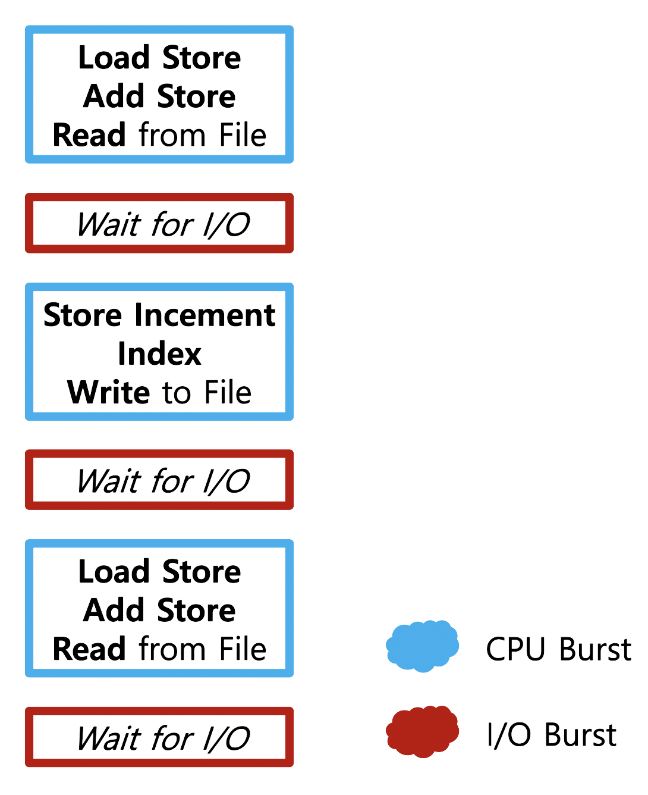

# CPU Scheduling 1

### CPU and I/O Bursts in Program Execution

### CPU-Burst Time 분포

- I/O Bound Job : CPU-Burst 사이에 I/O Burst가 자주 들어오는 작업 (Interactive)
- CPU Bound Job : CPU-Burst가 오래 지속되는 작업

여러 작업이 섞여 있기 때문에 CPU 스케줄링 필요

- Interactive Job에게 적절한 Response 제공 요망
- 시스템 자원을 골고루 효율적으로 사용

### 프로세스 특성 분류

- I/O Bound Process : Many Short CPU Bursts
- CPU Bound Process : Few Very Long CPU Bursts (계산 위주)

### CPU Scheduler & Dispatcher

- CPU Scheduler : Ready 상태의 프로세스 중 CPU를 할당할 프로세스를 결정 (운영체제의 커널 Code의 일부분)

- Dispatcher : CPU 제어권을 선택된 프로세스에 넘기는 역할 (마찬가지로 운영체제 커널 Code의 일부분)    *cf) 문맥교환*

- CPU Scheduling이 필요한 경우

  - Terminated
  - Running > Blocked

     위 경우의 스케줄링은 강제로 빼앗지 않고 자진 반납한 경우 (==Nonpreemptive==)

  - Running > Ready
  - Blocked > Ready

     등의 경우에는 스케줄링이 강제로 빼앗긴 경우 (==Preemptive==)